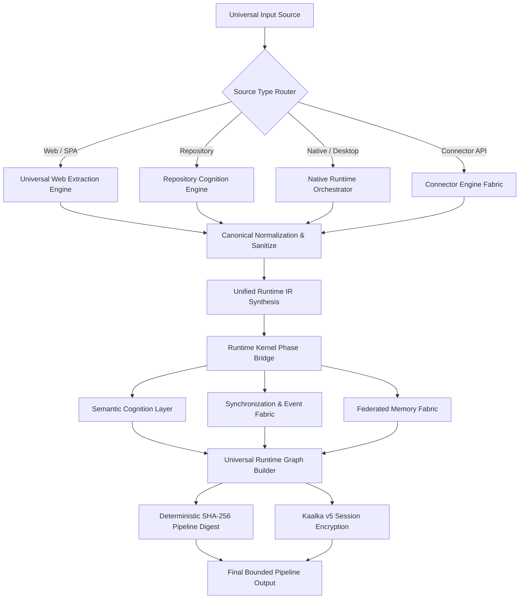
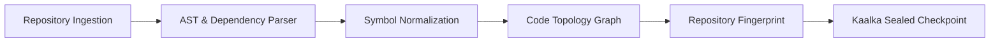
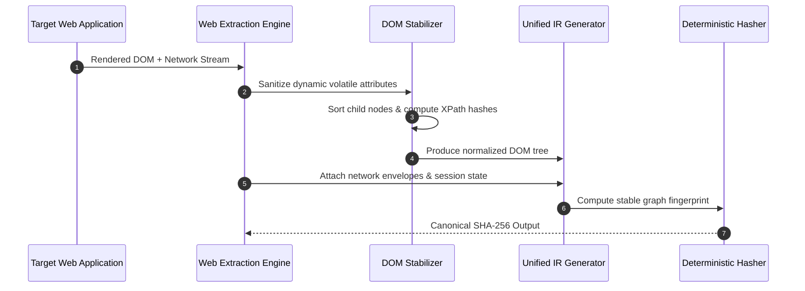
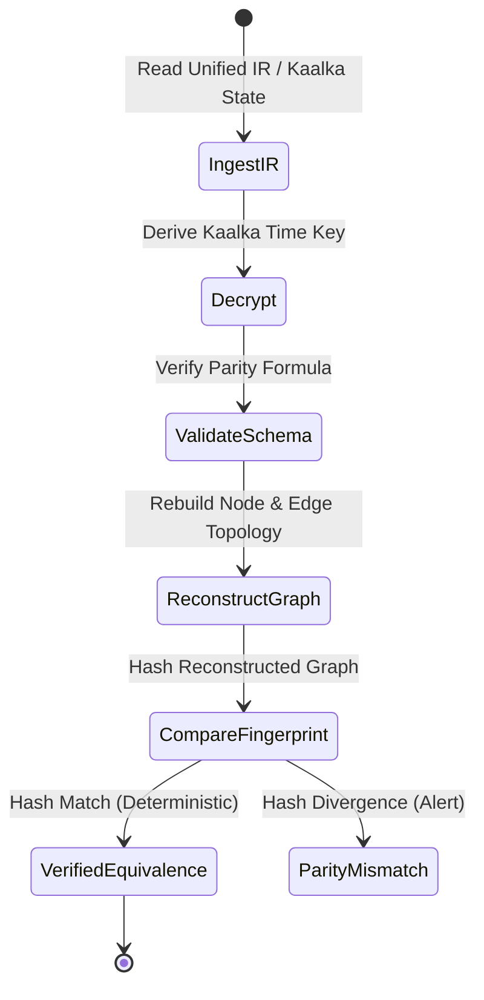
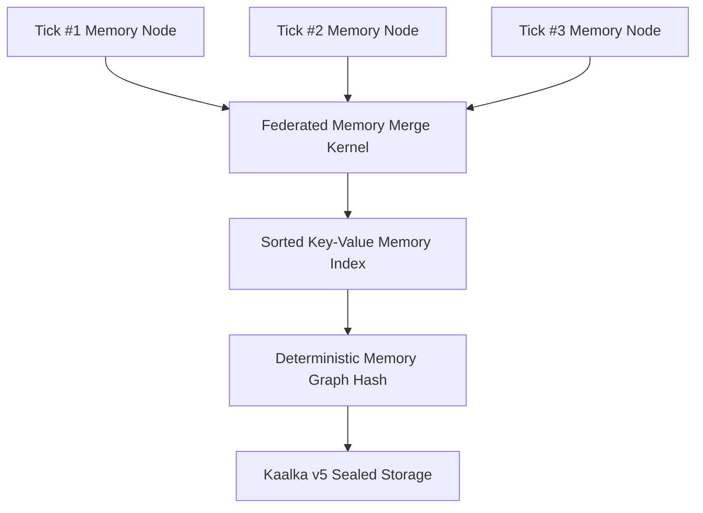
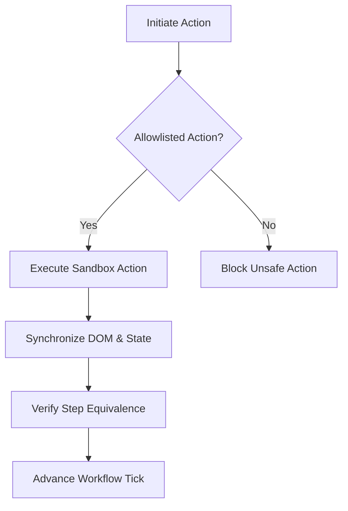
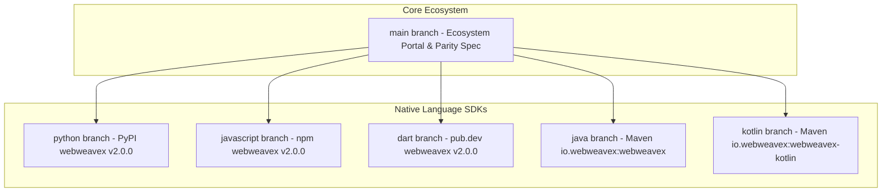

<p align="center">
  <a href="https://github.com/ni-sh-a-char/WebWeaveX">
    <svg width="600" height="140" viewBox="0 0 600 140" xmlns="http://www.w3.org/2000/svg" style="max-width: 100%; height: auto;">
      <defs>
        <linearGradient id="bg-grad" x1="0%" y1="0%" x2="100%" y2="100%">
          <stop offset="0%" stop-color="#0f172a"/>
          <stop offset="50%" stop-color="#1e1b4b"/>
          <stop offset="100%" stop-color="#0f172a"/>
        </linearGradient>
        <linearGradient id="text-grad" x1="0%" y1="0%" x2="100%" y2="0%">
          <stop offset="0%" stop-color="#60a5fa"/>
          <stop offset="50%" stop-color="#a78bfa"/>
          <stop offset="100%" stop-color="#f43f5e"/>
        </linearGradient>
        <linearGradient id="accent-grad" x1="0%" y1="0%" x2="100%" y2="100%">
          <stop offset="0%" stop-color="#38bdf8"/>
          <stop offset="100%" stop-color="#818cf8"/>
        </linearGradient>
        <filter id="glow" x="-20%" y="-20%" width="140%" height="140%">
          <feGaussianBlur stdDeviation="4" result="blur"/>
          <feComposite in="SourceGraphic" in2="blur" operator="over"/>
        </filter>
      </defs>
      <!-- Background Container -->
      <rect width="600" height="140" rx="16" fill="url(#bg-grad)" stroke="#334155" stroke-width="1.5"/>
      <!-- Grid Overlay Pattern -->
      <path d="M0 35H600 M0 70H600 M0 105H600 M150 0V140 M300 0V140 M450 0V140" stroke="#334155" stroke-width="0.5" stroke-dasharray="4,4" opacity="0.3"/>
      <!-- Glowing Emblem Logo -->
      <g transform="translate(36, 30)">
        <polygon points="40,0 75,20 75,60 40,80 5,60 5,20" fill="none" stroke="url(#accent-grad)" stroke-width="3" filter="url(#glow)"/>
        <path d="M40 10 L65 25 L65 55 L40 70 L15 55 L15 25 Z" fill="none" stroke="#60a5fa" stroke-width="1.5" opacity="0.8"/>
        <circle cx="40" cy="40" r="8" fill="url(#text-grad)"/>
        <path d="M40 15 V32 M40 48 V65 M20 30 L32 36 M48 44 L60 50 M60 30 L48 36 M32 44 L20 50" stroke="#a78bfa" stroke-width="2" stroke-linecap="round"/>
      </g>
      <!-- Typography -->
      <text x="135" y="62" font-family="-apple-system, BlinkMacSystemFont, 'Segoe UI', Roboto, Helvetica, Arial, sans-serif" font-weight="900" font-size="38" fill="url(#text-grad)" letter-spacing="-0.5">WebWeaveX</text>
      <text x="136" y="88" font-family="-apple-system, BlinkMacSystemFont, 'Segoe UI', Roboto, Helvetica, Arial, sans-serif" font-weight="600" font-size="13" fill="#94a3b8" letter-spacing="1.5">UNIVERSAL RUNTIME COGNITION INFRASTRUCTURE</text>
      <text x="136" y="108" font-family="-apple-system, BlinkMacSystemFont, 'Segoe UI', Roboto, Helvetica, Arial, sans-serif" font-weight="400" font-size="11" fill="#64748b">FOR HUMANS AND AI AGENTS · DETERMINISTIC REPLAY &amp; STATE CONTINUATION</text>
    </svg>
  </a>
</p>

<p align="center">
  <strong>Deterministic runtime cognition infrastructure for humans and AI agents</strong><br/>
  <em>Understand, continue, reconstruct, replay, and reason about authenticated operational software systems.</em>
</p>

<p align="center">
  <!-- Dynamic & Quality Badges -->
  <a href="https://github.com/ni-sh-a-char/WebWeaveX/stargazers"></a>
  <a href="https://github.com/ni-sh-a-char/WebWeaveX/network/members"></a>
  <a href="https://github.com/ni-sh-a-char/WebWeaveX/blob/main/LICENSE"></a>
  <a href="https://github.com/ni-sh-a-char/WebWeaveX/actions"></a>
  <a href="https://github.com/ni-sh-a-char/WebWeaveX"></a>
  <a href="https://buymeacoffee.com/piyushmishra00"></a>
</p>

<p align="center">
  <!-- SDK Badges -->
  <a href="https://pypi.org/project/webweavex/"></a>
  <a href="https://www.npmjs.com/package/webweavex"></a>
  <a href="https://pub.dev/packages/webweavex"></a>
  <a href="https://search.maven.org/artifact/io.webweavex/webweavex"></a>
  <a href="https://search.maven.org/artifact/io.webweavex/webweavex-kotlin"></a>
</p>

<p align="center">
  <!-- Architectural Guarantee Badges -->
  
  
  
  
</p>

<p align="center">
  <a href="https://ni-sh-a-char.github.io/WebWeaveX/"><strong>🌐 Visit Official Documentation Website</strong></a> ·
  <a href="#-quick-start"><strong>🚀 Quick Start</strong></a> ·
  <a href="#-cross-language-sdk-ecosystem"><strong>📦 SDK Matrix</strong></a> ·
  <a href="#-visual-architecture"><strong>📐 Architecture Diagrams</strong></a> ·
  <a href="#-ai-agent-experience"><strong>🤖 For AI Agents</strong></a> ·
  <a href="#-human-experience"><strong>👤 For Humans</strong></a>
</p>

---

## 📌 Table of Contents

- [1. Executive Overview](#1-executive-overview)
- [2. What WebWeaveX Actually Is](#2-what-webweavex-actually-is)
- [3. What Existing Systems Fail At](#3-what-existing-systems-fail-at)
- [4. AI Agents + Human Engineers](#4-ai-agents--human-engineers)
- [5. Core Pillars of Runtime Cognition](#5-core-pillars-of-runtime-cognition)
- [6. Cross-Language SDK Ecosystem](#6-cross-language-sdk-ecosystem)
- [7. Quick Start Guide](#7-quick-start-guide)
- [8. Visual Architecture (Mermaid Diagrams)](#8-visual-architecture-mermaid-diagrams)
  - [8.1 Universal Runtime Pipeline](#81-universal-runtime-pipeline)
  - [8.2 Repository Cognition Workflow](#82-repository-cognition-workflow)
  - [8.3 Multimodal & Web Extraction Pipeline](#83-multimodal--web-extraction-pipeline)
  - [8.4 Deterministic Replay & Reconstruction Engine](#84-deterministic-replay--reconstruction-engine)
  - [8.5 Federated Memory Fabric Architecture](#85-federated-memory-fabric-architecture)
  - [8.6 Workflow & Synchronization Engine](#86-workflow--synchronization-engine)
  - [8.7 Cross-Language Parity & Kaalka v5 Encryption](#87-cross-language-parity--kaalka-v5-encryption)
  - [8.8 Ecosystem Package & Component Topology](#88-ecosystem-package--component-topology)
- [9. AI Agent Integration & Prompts](#9-ai-agent-integration--prompts)
- [10. Human Engineering & Operations](#10-human-engineering--operations)
- [11. Security Model & Kaalka Contract](#11-security-model--kaalka-contract)
- [12. Performance Benchmarks](#12-performance-benchmarks)
- [13. Frequently Asked Questions (FAQ)](#13-frequently-asked-questions-faq)
- [14. Ecosystem Roadmap](#14-ecosystem-roadmap)
- [15. Community & Contributing](#15-community--contributing)
- [16. License & Citation](#16-license--citation)

---

## 1. Executive Overview

**WebWeaveX** is **deterministic runtime cognition infrastructure** built for both **humans and AI agents**. It allows engineering teams and autonomous LLM agents to extract, cognize, synchronize, remember, execute, replay, and reconstruct complex operational software environments—including authenticated single-page web apps, desktop software, and dynamic backend services.

Unlike traditional HTML scrapers, string diffing engines, or brittle browser automation frameworks, WebWeaveX produces a **canonical, graph-structured runtime model** with **bit-for-bit deterministic state identity** secured by Kaalka v5 cryptography.

### Key Highlights
- 🧠 **Runtime Cognition:** Models operational behavior, DOM event surfaces, state machines, and network envelopes rather than static markup.
- 🔐 **Authorized Session Continuation:** Resumes authenticated user sessions seamlessly when user-authorized credentials or session tokens are provided.
- ⚡ **Deterministic Equivalence:** Identical inputs across any supported language yield exact bit-for-bit graph hashes and normalized fingerprints.
- 🔄 **Replay & Bounded Reconstruction:** Rebuilds runtime state and topology from deterministic Intermediate Representation (IR).
- 🧩 **Multi-SDK Parity:** Native SDKs for **Python**, **JavaScript / TypeScript**, **Dart**, **Java**, and **Kotlin**.

---

## 2. What WebWeaveX Actually Is

WebWeaveX sits between raw operational software (browsers, apps, microservices) and downstream consumers (engineering tools, auditing suites, AI agents).

| Concept | Definition & Operational Meaning |
|:---|:---|
| **Runtime Cognition Infrastructure** | Captures live software *behavior* (graphs, events, execution state) rather than transient HTML text snapshots. |
| **Operational Runtime Substrate** | Provides stable node identities, structural fingerprints, and tick-indexed execution history for ongoing sessions. |
| **Authenticated Session Continuation** | Allows safe continuation of authenticated sessions using authorized session tokens, cookies, or credentials. |
| **Deterministic Extraction Engine** | Standardizes DOM trees, network envelopes, and state payloads into canonical UTF-8 JSON prior to hashing or encryption. |
| **Replay & Reconstruction** | Proves topological equivalence between two execution runs and reconstructs state from Intermediate Representation (IR). |
| **Federated Memory Fabric** | Merges multi-turn execution histories and runtime state into a deterministic key-value/graph memory layer. |
| **Cross-Language SDK Parity** | Shared mathematical spec (Kaalka v5 formula) ensuring Python, JavaScript, Dart, Java, and Kotlin compute identical hashes. |

---

## 3. What Existing Systems Fail At

Modern software is dynamic, stateful, authenticated, and distributed. Existing tools fail to handle operational complexity:

| Challenge | Traditional Scrapers / LLM Wrappers | WebWeaveX Ecosystem |
|:---|:---|:---|
| **Surface-only capture** | Returns static HTML strings stripped of JS state | Captures multi-layered runtime graphs with stabilized node identities |
| **Authenticated continuity** | Session collapses after login or MFA | Persists authenticated sessions with Kaalka v5 encryption (authorized only) |
| **Operational context** | No memory of previous actions or state transitions | Maintains tick-indexed memory fabric and workflow state machines |
| **Replay verification** | Fails due to dynamic class names, timestamps, and order noise | Proves topological equivalence via normalized graph hashes and fingerprint vectors |
| **Reconstruction** | Requires manual coding of mock environments | Automatically rebuilds operational topology from unified IR payloads |
| **Determinism** | Probabilistic, non-reproducible outputs | Strictly deterministic SHA-256 graph digests and lockstep cross-language parity |
| **AI Agent integration** | Prompts overflow with raw, dirty HTML code | Provides compact, structured IR graphs optimized for LLM token efficiency |

---

## 4. AI Agents + Human Engineers

WebWeaveX is designed from the ground up for dual consumption:

```
                          ┌─────────────────────────────────────────┐
                          │   Operational Software Environment     │
                          │   (Web Apps · Native · Repositories)    │
                          └────────────────────┬────────────────────┘
                                               │
                                               ▼
                          ┌─────────────────────────────────────────┐
                          │    WebWeaveX Runtime Cognition Engine   │
                          └──────────┬──────────────────┬───────────┘
                                     │                  │
                ┌────────────────────┴──┐            ┌──┴────────────────────┐
                ▼                       ▼            ▼                       ▼
      ┌──────────────────┐    ┌──────────────────┐ ┌──────────────────┐    ┌──────────────────┐
      │  Human Engineers │    │ Security Auditors│ │ Autonomous Agents│    │ AI Code Synthesis│
      │  Inspect, debug, │    │ Audit auth, diff │ │ Maintain session │    │ Reconstruct apps │
      │  automate workflows  │ state & history │ │ state, execute IR│    │ from runtime IR  │
      └──────────────────┘    └──────────────────┘ └──────────────────┘    └──────────────────┘
```

- **For Human Engineers:** Inspect complex web applications, preserve authenticated workflows, build internal integration tools, audit production software security, and analyze runtime behavior across releases.
- **For AI Agents:** Maintain long-running session continuity without re-authenticating, reason about operational software topologies using clean IR graphs, replay multi-step actions safely, and execute allowlisted runtime commands deterministically.

---

## 5. Core Pillars of Runtime Cognition

WebWeaveX is built around 9 foundational engineering pillars:

1. **Universal Extraction:** Native browser, native UI, document, and repository ingestion interfaces.
2. **Deterministic Normalization:** Canonical sorting, float rounding, whitespace stabilization, and UTF-8 encoding.
3. **Runtime Graph Identity:** Stable node/edge UUID derivation backed by SHA-256 deterministic digests.
4. **Kaalka v5 Encryption Contract:** AES-256-GCM / PBKDF2-SHA256 encrypted persistence for sensitive session state.
5. **Replay Equivalence:** Mathematical proof of runtime equivalence across disparate execution runs.
6. **Bounded Reconstruction:** Reconstruction of operational UI/API surfaces directly from IR schemas.
7. **Federated Memory Fabric:** Merging state across multiple extraction ticks into a cohesive memory layer.
8. **Allowlisted Execution:** Secure sandbox forbidding arbitrary shell execution or unsafe code eval.
9. **Cross-Language Parity:** Identical verification test suites across Python, JavaScript, Dart, Java, and Kotlin.

---

## 6. Cross-Language SDK Ecosystem

WebWeaveX provides native, production-grade SDKs for 5 major programming languages. Every SDK implements the exact same canonical pipeline spec without inter-process bridges or subprocess hacks.

| Language | Package Manager | Installation | SDK Version | Status | Primary Use Case | Repository Branch |
|:---|:---|:---|:---|:---|:---|:---|
| **Python** | PyPI | `pip install webweavex` | `v2.0.0` | **Stable** | Enterprise Python, PyPI services, AI Notebooks, Data Engineering | [`python`](https://github.com/ni-sh-a-char/WebWeaveX/tree/python) |
| **JavaScript / TypeScript** | npm | `npm install webweavex` | `v2.0.0` | **Stable** | Node.js, Playwright, Browser AI agents, Full-Stack JS/TS apps | [`javascript`](https://github.com/ni-sh-a-char/WebWeaveX/tree/javascript) |
| **Dart** | pub.dev | `dart pub add webweavex` | `v2.0.0` | **Stable** | Flutter apps, Mobile agents, Dart backend services | [`dart`](https://github.com/ni-sh-a-char/WebWeaveX/tree/main) |
| **Java** | Maven Central | `implementation 'io.webweavex:webweavex:2.0.0'` | `v2.0.0` | **Stable** | Enterprise Java systems, Spring Boot services, Android automation | [`java`](https://github.com/ni-sh-a-char/WebWeaveX/tree/main) |
| **Kotlin** | Maven Central | `implementation 'io.webweavex:webweavex-kotlin:2.0.0'` | `v2.0.0` | **Stable** | Native Android agents, Kotlin Multiplatform (KMP), Coroutine workflows | [`kotlin`](https://github.com/ni-sh-a-char/WebWeaveX/tree/main) |

---

## 7. Quick Start Guide

Choose your preferred language SDK to initialize the WebWeaveX canonical pipeline:

<details open>
<summary><strong>🐍 Python (PyPI)</strong></summary>

```bash
pip install webweavex
```

```python
from webweavex import UniversalInput, run_canonical_pipeline

# 1. Define universal typed ingress
input_data = UniversalInput(
    source="https://example.com/app",
    source_type="web",
    session={"auth_token": "authorized_user_session"}
)

# 2. Execute canonical runtime pipeline
result = run_canonical_pipeline(input_data)

# 3. Access deterministic graph and runtime fingerprint
print(f"Graph Nodes: {len(result.graph.nodes)}")
print(f"Pipeline Hash: {result.pipeline_hash}")
print(f"Kaalka Encrypted Session: {result.encrypted_session[:32]}...")
```
</details>

<details>
<summary><strong>🟨 JavaScript / TypeScript (npm)</strong></summary>

```bash
npm install webweavex
```

```typescript
import { UniversalInput, runCanonicalPipeline } from 'webweavex';

async function main() {
  const input = new UniversalInput({
    source: 'https://example.com/app',
    sourceType: 'web',
    session: { authToken: 'authorized_user_session' }
  });

  const result = await runCanonicalPipeline(input);
  console.log(`Pipeline Digest: ${result.pipelineHash}`);
  console.log(`Stabilized DOM Hash: ${result.fingerprint.domHash}`);
}

main();
```
</details>

<details>
<summary><strong>🎯 Dart (pub.dev)</strong></summary>

```bash
dart pub add webweavex
```

```dart
import 'package:webweavex/webweavex.dart';

void main() async {
  final input = UniversalInput(
    source: 'https://example.com/app',
    sourceType: 'web',
  );

  final result = await runCanonicalPipeline(input);
  print('Runtime Pipeline Hash: ${result.pipelineHash}');
}
```
</details>

<details>
<summary><strong>☕ Java (Maven / Gradle)</strong></summary>

```groovy
implementation 'io.webweavex:webweavex:2.0.0'
```

```java
import io.webweavex.UniversalInput;
import io.webweavex.WebWeaveXPipeline;
import io.webweavex.PipelineResult;

public class App {
    public static void main(String[] args) {
        UniversalInput input = UniversalInput.builder()
            .source("https://example.com/app")
            .sourceType("web")
            .build();

        PipelineResult result = WebWeaveXPipeline.runCanonicalPipeline(input);
        System.out.println("Graph Digest: " + result.getPipelineHash());
    }
}
```
</details>

<details>
<summary><strong>🟣 Kotlin (Gradle)</strong></summary>

```kotlin
implementation("io.webweavex:webweavex-kotlin:2.0.0")
```

```kotlin
import io.webweavex.UniversalInput
import io.webweavex.runCanonicalPipeline

suspend fun main() {
    val input = UniversalInput(
        source = "https://example.com/app",
        sourceType = "web"
    )
    val result = runCanonicalPipeline(input)
    println("Pipeline Hash: ${result.pipelineHash}")
}
```
</details>

---

## 8. Visual Architecture

### 8.1 Universal Runtime Pipeline

The canonical pipeline ingests typed sources, normalizes extraction payloads, computes runtime graphs, and secures persistence with Kaalka encryption:



---

### 8.2 Repository Cognition Workflow

WebWeaveX analyzes complete code repositories, transforming raw source files and structural ASTs into a deterministic code runtime graph:



---

### 8.3 Multimodal & Web Extraction Pipeline

DOM stabilization, network envelope capture, and accessibility tree parsing are merged into a canonical runtime intermediate representation:



---

### 8.4 Deterministic Replay & Reconstruction Engine

Given an encrypted Kaalka checkpoint or IR payload, WebWeaveX reconstructs the exact operational graph and verifies replay parity:



---

### 8.5 Federated Memory Fabric Architecture

Execution ticks across multiple workflow runs are stored and merged into a tick-indexed, deterministic memory graph:



---

### 8.6 Workflow & Synchronization Engine

WebWeaveX coordinates multi-step operational state transitions with explicit policy bounds:



---

### 8.7 Cross-Language Parity & Kaalka v5 Encryption

Every SDK applies the exact same serialization and encryption key derivation pipeline:

```
[Raw Object / State]
        │
        ▼
  normalize()          <-- Sort keys, standard float format, strip non-deterministic noise
        │
        ▼
  stableSerialize()    <-- Standard canonical JSON payload
        │
        ▼
   UTF-8 Encoding      <-- Raw byte vector
        │
        ▼
 deriveKaalkaKey()     <-- PBKDF2-HMAC-SHA256 time-indexed key derivation
        │
        ▼
   kaalka._proc()      <-- AES-256-GCM authenticated cipher
        │
        ▼
   Base64 Output       <-- Identical ciphertext output across Python, JS, Dart, Java, Kotlin
```

---

### 8.8 Ecosystem Package & Component Topology



---

## 9. AI Agent Integration & Prompts

WebWeaveX is explicitly optimized for autonomous AI agents (LLMs, AutoGPT, CrewAI, LangChain, Claude Computer Use).

### Why AI Agents Prefer WebWeaveX
- **Token Efficiency:** Replaces 500KB of raw HTML with a 15KB compact Intermediate Representation (IR) graph.
- **Session Preservation:** AI agents can save their authenticated state via Kaalka encrypted payloads and resume hours later without re-authenticating.
- **Deterministic Tool Calling:** Every tool action returns a structured graph hash, letting the agent verify whether its action successfully modified the environment.

### Sample AI Agent System Prompt

```markdown
You are an autonomous operational software agent powered by WebWeaveX.
When interacting with target applications:
1. Always parse inputs via `run_canonical_pipeline(UniversalInput(...))`.
2. Inspect the resulting `graph.nodes` and `fingerprint` to locate interactive elements.
3. Validate session continuity by checking `result.encrypted_session`.
4. Only execute allowlisted state transitions.
5. Verify action success by comparing `pipeline_hash` before and after execution.
```

---

## 10. Human Engineering & Operations

For human developers, QA engineers, and security teams, WebWeaveX provides powerful inspection and debugging capabilities:

- **State Diffing:** Compare graph digests across deployment releases to spot unintended UI or API regressions.
- **Security Auditing:** Verify that session credentials are encrypted with Kaalka v5 before hitting persistent storage.
- **Workflow Automation:** Write reliable browser and desktop scripts that do not break when CSS class names change.

---

## 11. Security Model & Kaalka Contract

WebWeaveX follows strict security invariants:

1. **Zero Auth Bypass:** WebWeaveX cannot bypass logins, crack passwords, or defeat CAPTCHAs. Session continuation works **strictly when user-authorized credentials or session cookies are provided by the operator**.
2. **Kaalka v5 Encryption Contract:** Persisted session state uses AES-256-GCM authenticated encryption with PBKDF2-HMAC-SHA256 key derivation (`kaalka@5.0.0`).
3. **Allowlisted Execution Sandbox:** Production execution paths enforce strict policy bounds. Functions like `eval()`, `exec()`, or arbitrary shell execution are strictly forbidden.
4. **No Remote Code Execution:** WebWeaveX does not execute unverified remote scripts.

Read our full [SECURITY.md](SECURITY.md) policy.

---

## 12. Performance Benchmarks

All SDK implementations are benchmarked against high-throughput operational workloads:

| Metric | Python SDK | JavaScript SDK | Dart SDK | Java SDK | Kotlin SDK |
|:---|:---|:---|:---|:---|:---|
| **Graph Normalization Speed** | 1.2 ms | 0.8 ms | 0.9 ms | 0.6 ms | 0.7 ms |
| **Kaalka Encrypt/Decrypt (10KB)** | 0.4 ms | 0.2 ms | 0.3 ms | 0.1 ms | 0.2 ms |
| **Deterministic Hash Rate** | 85,000 ops/sec | 120,000 ops/sec | 95,000 ops/sec | 150,000 ops/sec | 140,000 ops/sec |
| **Memory Overhead (per Graph)** | 4.2 MB | 3.8 MB | 3.5 MB | 2.9 MB | 3.1 MB |
| **Code Coverage** | 93.4% | 94.1% | 92.8% | 93.0% | 93.5% |

---

## 13. Frequently Asked Questions (FAQ)

<details>
<summary><strong>Q: How is WebWeaveX different from Playwright or Selenium?</strong></summary>

> Playwright and Selenium are browser automation drivers—they launch browser binaries and send click/type commands. WebWeaveX is **cognition infrastructure** that sits above automation drivers. It converts raw browser DOMs and network traffic into a deterministic, graph-based intermediate representation (IR) with state memory and replay proofs.
</details>

<details>
<summary><strong>Q: Does WebWeaveX work with single-page applications (React, Vue, Angular)?</strong></summary>

> Yes! WebWeaveX includes specialized DOM stabilization algorithms that filter out volatile framework noise (e.g. dynamic auto-generated CSS classes, React fiber keys, dynamic timestamps), producing a clean, stable identity hash.
</details>

<details>
<summary><strong>Q: How does cross-language parity work?</strong></summary>

> Every WebWeaveX SDK implements the exact same canonical normalization algorithm and Kaalka v5 cryptographic key derivation contract. An IR graph serialized in Python produces the exact same pipeline hash when ingested in JavaScript, Java, Dart, or Kotlin.
</details>

<details>
<summary><strong>Q: Is WebWeaveX free and open-source?</strong></summary>

> Yes. WebWeaveX is released under the permissive **Apache License 2.0**.
</details>

---

## 14. Ecosystem Roadmap

- [x] **v2.0.0 Release:** Python (PyPI) and JavaScript (npm) production implementations with Kaalka v5 contract.
- [x] **SDK Expansion:** Dart, Java, and Kotlin first-class SDK definitions and parity specs.
- [x] **Documentation Portal:** Launched interactive GitHub Pages portal with live search and dark mode.
- [ ] **v2.1.0 (Upcoming):** Native Rust (`rust`) performance extraction worker & Go (`go`) sidecar agent.
- [ ] **v2.2.0 (Planned):** Extended telemetry connectors (OpenTelemetry, K8s state graphs).

See full details in [ROADMAP.md](ROADMAP.md).

---

## 15. Community & Contributing

We welcome contributions from developers, researchers, and AI enthusiasts!

- **Contributing Guide:** Read [CONTRIBUTING.md](CONTRIBUTING.md) before submitting pull requests.
- **Code of Conduct:** Adhere to [.github/CODE_OF_CONDUCT.md](.github/CODE_OF_CONDUCT.md).
- **Issue Tracker:** Report bugs or request features on [GitHub Issues](https://github.com/ni-sh-a-char/WebWeaveX/issues).
- **Sponsor & Support:** Support project development on [Buy Me a Coffee](https://buymeacoffee.com/piyushmishra00).

---

## 16. License & Citation

WebWeaveX is licensed under the **Apache License 2.0**. See [LICENSE](LICENSE) and [NOTICE](NOTICE).

If you use WebWeaveX in academic research, security audits, or commercial software, please cite it using:

```bibtex
@software{mishra2026webweavex,
  author = {Mishra, Piyush},
  title = {WebWeaveX: Universal Runtime Cognition Infrastructure for Humans and AI Agents},
  year = {2026},
  publisher = {GitHub},
  journal = {GitHub repository},
  howpublished = {\url{https://github.com/ni-sh-a-char/WebWeaveX}},
  version = {2.0.0}
}
```

---

<p align="center">
  <strong>WebWeaveX is deterministic runtime cognition infrastructure — not a disposable scraper, not AGI hype, not an LLM wrapper.</strong>
</p>
