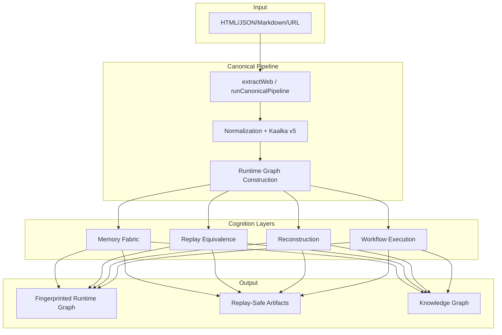
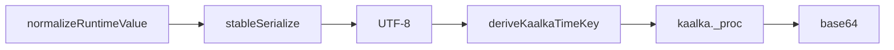
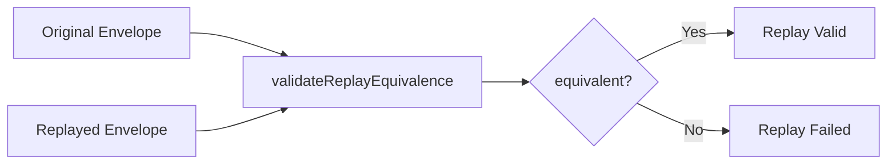
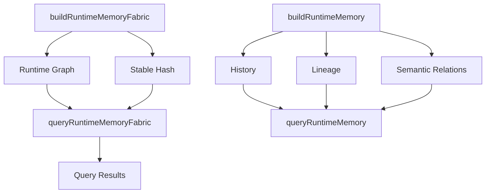
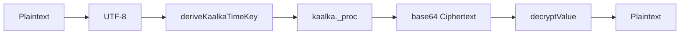
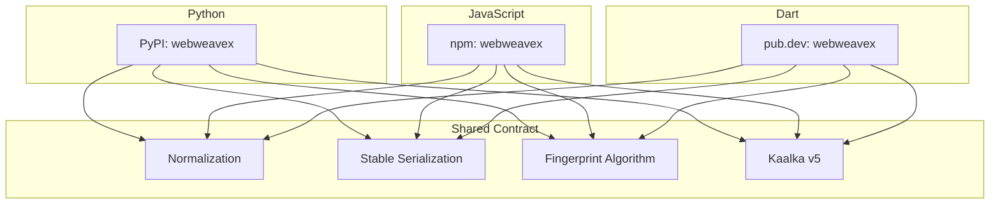
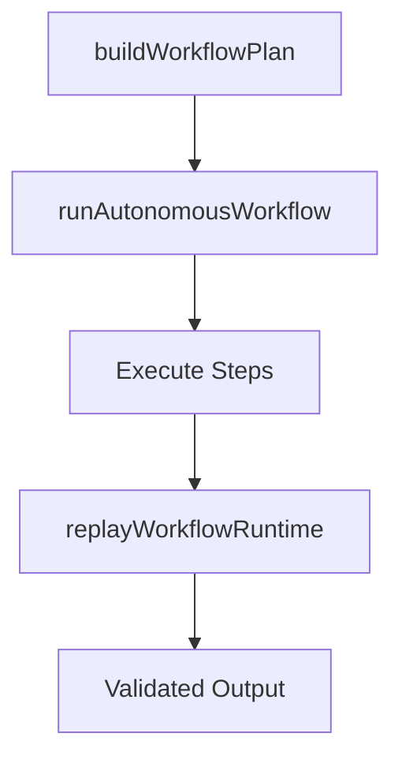
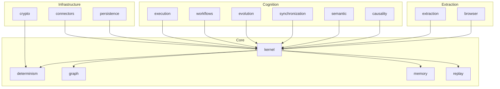

# WebWeaveX Dart SDK — Architecture

## System Architecture

## Deterministic Runtime Flow

## Replay Pipeline

## Memory Lineage

## Kaalka Runtime

## Cross-Language Architecture

## Workflow Execution

## Module Dependencies

